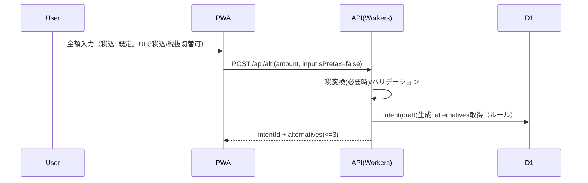
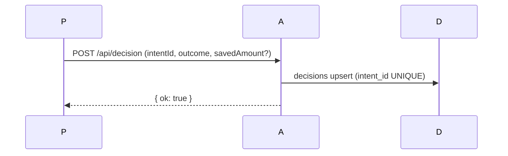
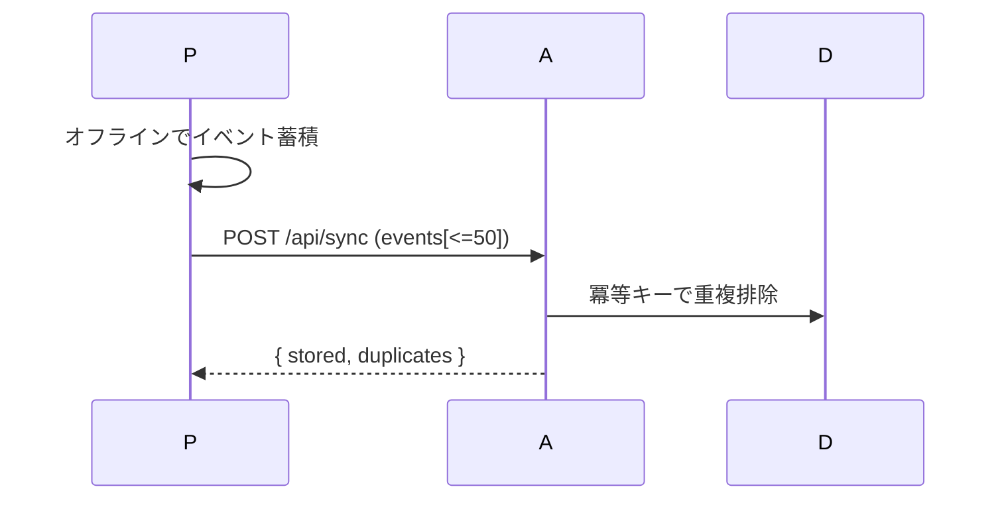

# アーキテクチャ概要

本システムは Edge ファーストのPWA＋Cloudflare Workers構成です。

## コンポーネント
- Web/PWA: Vite + React + TS（オフライン入力キュー、トーン設定）
- API: Hono on Cloudflare Workers（Zod検証、冪等キー、レート制限想定）
- DB: D1(SQLite@Edge) + Drizzle（マイグレーション）
- 監視: Workers Analytics / Sentry

## シーケンス（代替案提示）

## シーケンス（意思決定）

## シーケンス（オフライン同期）

## 非機能
- レイテンシ目標: 代替案（ルール）P95 300ms
- スケーラビリティ: Workers水平スケール、D1リード主体
- フォールバック: AI失敗→ルール、集計失敗→暫定表示

### 補足
- `/api/alt` は `intents` を `status='draft'` で永続化し、未決断は 24h で `expired`。

## 型の流れ（ソースオブトゥルース）
- 真実: `openapi/openapi.yaml`
- 生成: `openapi-typescript` で `packages/shared/types` に型を出力
- サーバ: Hono で Zod による I/O 検証 + 生成型を参照
- クライアント/PWA: 生成型を参照（列挙 `hungerLevel/category` をユニオンで共有）
