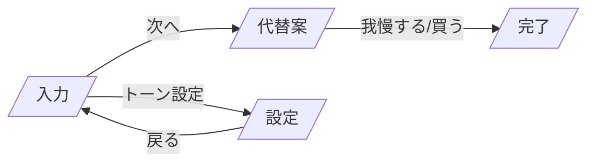

# フロントエンドデザイン提案: 縦長からSPA遷移へ

作成日: 2025-11-01
対象: packages/web (Vite + React)

### 更新メモ（2025-11-02）
- 入力プレビューを完全に廃止し、金額入力後は即遷移する方針を明文化。
- 金額入力フィールドで Enter キー（フォーム送信）を押すと「代替案」画面へ遷移する仕様を追加。
- ローカル開発の想定 URL を `http://localhost:8787` として明記。

## 背景と課題
- 現状は単一ページに「入力 → プレビュー → 代替案 → 意思決定」を縦積みで表示。
- スクロール量が増え、主要CTAが視界から外れやすい。
- 状態（入力中/取得中/結果/完了）が同一DOMに混在し、ブラウザの戻る/更新の期待と一致しない。
- 共有・再訪問に弱い（URLに状態が反映されない）。

## 目標（UX原則）
- 1操作=1画面の明確な遷移。主動線は常に画面内に固定。
- URLに状態を反映し、リロードや共有でも再現可能。
- オフライン/再送キューに配慮しつつ、誤二重登録は冪等キーで抑止。
- 既存コンポーネントの再利用を最優先（破壊的変更を避ける）。

## 情報設計 / ルーティング
- `/` 入力（AmountPage）
  - 金額入力のみ。入力プレビューは設けない。
  - 「次へ」ボタン、または Enter キー（フォーム送信）で `/alternatives` に遷移。
  - トーンの変更UIは置かない（設定画面で事前選択）。
- `/alternatives?amount=500&key=<idemKey>` 代替案（AlternativesPage）
  - 初回マウント時に POST `/api/alt`（`Idempotency-Key` ヘッダー付与）。
  - トーンはユーザー設定（`useTonePreference`）から読み込む。URLには含めない。
  - 取得中はスケルトン/ローディング。結果表示後に「我慢する/買う」。
- `/done?status=avoided|purchased` 完了（DonePage）
  - 記録完了の明示とトップへの導線。
- `/settings/tone` 設定（TonePage）
  - トーン選択をこの画面に集約。流れの中では変更しない。

Workers 側は既に SPA フォールバック（`index.html`）が実装済みのためインフラ変更は不要（`packages/api/src/index.ts` 参照）。

### インタラクション仕様（AmountPage）
- 送信方法: 金額入力を `<form>` でラップし、`onSubmit` による遷移を正とする。
  - Enter キーはフォーム送信として扱う（独自の `onKeyDown` での横取りはしない）。
  - IME 確定前の Enter は送信しない（ブラウザ標準の合成文字列完了後＝`compositionend` 後に送信）。
- 入力制約: 円建ての整数（小数なし）。最小 1、最大 9,999,999。
  - 推奨属性: `type="text"` + `inputmode="numeric"` + `pattern="[0-9]*"` + `maxLength=7`。
  - 備考: `type="number"` を使う場合は `min=1` `max=9999999` `step=1` を指定。
  - 無効値（空/0/上限超過/非数）は送信をキャンセルし、入力下にヘルプテキストまたはエラーを表示。
- 遷移: `navigate('/alternatives?amount=' + amount + '&key=' + idemKey)`。
- フォーカス管理: 遷移後は AlternativesPage の `h1` にフォーカスを移動。
- アニメーション: 送信時にボトムバー CTA に短いプレスフィードバック（150ms）を付与（任意）。

#### エラーハンドリング（デフォルト文言）
- 基本メッセージ: `1〜9,999,999 の整数を入力してください。`
- 下限未満（0以下）: `1以上の金額を入力してください。`
- 上限超過（10,000,000以上）: `9,999,999円以下で入力してください。`

### 遷移フロー（Mermaid）


## UI構成
- 固定ヘッダー: タイトル + オンライン状態 + 設定アイコン（右上）。
- トーン表示: ヘッダーに現在のトーンのバッジを表示（例: gentle/humor/spartan）。クリックで `/settings/tone` へ遷移。
- ステップ表示: 「入力 → 代替案 → 完了」を示すシンプルなインジケータ。
- 固定ボトムバー: 主要CTA（次へ/戻る）を常時表示。縦スクロールの影響を受けない。
- ページカード: 現行のガラス風カードスタイルを踏襲しつつ、各ページに1カードを基本とする。
 - 入力プレビュー要素は存在しない（カード内はフィールドと補助テキストのみ）。

### AlternativesPage の文言・表示
- 見出し: `代替案`
- サブテキスト: `気に入った代替案があれば「我慢する」を選んで記録しましょう。`
- 非表示（削除）: 金額に依存したサブヘッド（例: `¥1,000 の購入を検討中`）は表示しない。
- リスト: 生成された代替案（番号付き）。各アイテム右端に「ルール」リンク。
- CTA: 下部に「我慢する」「買う」を横並びで配置。
- レイアウト: `AlternativesList` コンポーネントは `.alts` ラッパーのみを描画し、`app__card app__card--info` 等の外枠は持たない（外側のカードは AlternativesPage が担当）。

## コンポーネント再配置
- `AmountInputCard` → AmountPage でそのまま使用。
- `AlternativesList` → AlternativesPage でそのまま使用。
- `ToneSelector` → TonePage（全画面）。
- `ToneSelectorModal` は利用しない（必要なら後方互換として残置可だがUIから到達不可）。
- `App` → `Layout`（ヘッダー/オフライン表示/`<Outlet/>`）へ役割変更。
 - 旧プレビュー関連のコンポーネント/スタイルは参照を外す（削除は別PRで可）。

## 状態・URL戦略
- `amount`: クエリパラメータで受け渡し（例: `?amount=500`）。
- `tone`: `useTonePreference`（localStorage）をソース・オブ・トゥルースとする。URLには含めない。
  - 既定値は `gentle`。未設定時はバナーで設定画面を案内（強制はしない）。
  - （オプション）デバッグ用に `?tone=...` を受け付け、アクセス時に一時上書き＋保存する運用も可。
- `key`: 代替案生成の冪等キーをクエリに付与（リロード/共有でも重複生成を防ぐ）。
- `offlineQueue`: 既存実装を継続利用。意思決定の送信失敗時はキューへ。

## トーン設定ポリシー（A案の確定）
- 既定値: `gentle`（ユーザー未設定でもこの値で進行可能）。
- 設定場所: `/settings/tone` に集約。入力/代替案/完了にはトーン変更UIを出さない。
- 表示: ヘッダー右上に「設定: <現在トーン>」リンク（例: `設定: gentle`）。
- 案内: 初回のみ軽いインライン案内（任意）
  - 例: 「トーンは設定から変更できます（現在: やさしい）」
  - 閉じる操作で以後は表示しない（localStorageで既読管理）。
- 適用範囲: `/api/alt` と `/api/decision` のリクエストに `tone` を付与。
- 永続化: `localStorage('wom-tone')`。既存の `useTonePreference` を利用。
- URL方針: `tone` はURLに含めず、共有/直打ちしてもユーザー設定が適用される。

### UI文言（案）
- ヘッダー: `設定: やさしい`（`gentle`/`ユーモア`/`スパルタ` を日本語ラベルで表示）
- 設定バナー: `トーンは設定から変更できます（現在: やさしい）`
- 設定画面の説明: `APIに送る代替案やメッセージのスタイルを設定します。`
- エラーメッセージ（デフォルト）: `1〜9,999,999 の整数を入力してください。`

## アクセシビリティ
- 画面遷移時に `h1` へフォーカスを移動。
- ローディングに `aria-busy`、結果メッセージに `aria-live="polite"`。
- ボトムバーの主要CTAに明確な `aria-label` とキーボードフォーカスリング。
 - 金額入力は `<form>` + `<button type="submit">次へ</button>` を用い、スクリーンリーダーでも Enter で送信できるようにする。

## ローディング/エラー/オフライン
- 代替案取得中は行アイテムのスケルトン3件を表示。
- オフライン時 `/alternatives` は説明と「入力へ戻る」を提示。オンライン復帰時はリトライ可。
- 意思決定は成功/失敗メッセージを明示（既存 `offlineQueue` を尊重）。

## 計測
- 画面滞在時間、代替案取得成功率、意思決定到達率（step-through）を Workers Analytics/PostHog で計測。
- 設定画面でのトーン選択イベント（表示→選択→保存）と、選択後のコンバージョン影響を計測。
- 主要CTAのクリック位置/頻度を記録してボトムバーの有効性を検証。

## 実装計画（最小差分）
1) ルーター導入
   - `pnpm -w add react-router-dom`
   - `packages/web/src/main.tsx` を `BrowserRouter` でラップ。
2) `App` の役割変更
   - レイアウト化し、`<Outlet/>` を設置。ヘッダー/オフライン表示を残す。
3) ページ追加
   - `routes/AmountPage.tsx`（入力）: 既存 `AmountInputCard` を使用し、次へで `navigate('/alternatives?...')`。トーン変更UIは削除。
   - `routes/AlternativesPage.tsx`（代替案）: `useEffect` で `/api/alt` POST。`useTonePreference.tone` を送信。
   - `routes/DonePage.tsx`（完了）。
   - `routes/TonePage.tsx`（設定）: `ToneSelector` を配置し、保存時に `useTonePreference.setTone` を呼ぶ。
   - フォローアップ: `AlternativesList` から `app__card` クラスを外し、`.alts` スタイルをコンポーネント内で完結させる。
4) API呼び出しの冪等化
   - `requestAlternatives` に `Idempotency-Key` ヘッダーを追加（`sendDecision` 同様の `generateId()` を再利用）。
5) E2E更新
   - 「入力→代替案→完了」のルート存在/フォーカス/主要ボタンを Playwright で検証。
   - 追加: 金額フィールドで Enter を押すと `/alternatives` へ遷移すること、無効値では遷移しないことを検証。
   - 追加: 上限値の境界テスト（`9,999,999` はOK、`10,000,000` はNGでエラー表示）。
   - 追加: AlternativesPage に `購入を検討中` の文言が存在しないことを検証。

### 参考コード（AmountPage の送信）
```tsx
// packages/web/src/routes/AmountPage.tsx（骨子）
import { useNavigate } from 'react-router-dom'
import { useIdemKey } from '../features/network/useIdemKey'

const MAX_AMOUNT = 9_999_999

export default function AmountPage(){
  const navigate = useNavigate()
  const { generate } = useIdemKey()
  const [amount, setAmount] = useState('')
  const [error, setError] = useState<string | null>(null)

  function validate(raw: string){
    if (!raw) return '1〜9,999,999 の整数を入力してください。'
    const n = Number(raw)
    if (!Number.isFinite(n)) return '1〜9,999,999 の整数を入力してください。'
    if (n < 1) return '1以上の金額を入力してください。'
    if (n > MAX_AMOUNT) return '9,999,999円以下で入力してください。'
    return null
  }

  function onSubmit(e: React.FormEvent){
    e.preventDefault()
    const nextError = validate(amount)
    if (nextError) { setError(nextError); return }
    const key = generate()
    navigate(`/alternatives?amount=${Number(amount)}&key=${key}`)
  }

  return (
    <form onSubmit={onSubmit} aria-labelledby="amount-title">
      <h1 id="amount-title">金額を入力</h1>
      <input
        type="text"
        inputMode="numeric"
        pattern="[0-9]*"
        maxLength={7}
        value={amount}
        onChange={(e)=>{
          const digits = e.currentTarget.value.replace(/\D+/g, '').slice(0, 7)
          setAmount(digits)
          setError(validate(digits))
        }}
        placeholder="例: 5000"
        aria-describedby="amount-help"
        aria-invalid={Boolean(error)}
      />
      <p id="amount-help">Enter で代替案へ進みます</p>
      {error && <p role="alert">{error}</p>}
      <button type="submit" disabled={Boolean(validate(amount))}>次へ</button>
    </form>
  )
}
```

### 参考コード（ルート定義の骨子）
```tsx
// packages/web/src/main.tsx
import { BrowserRouter, Routes, Route } from 'react-router-dom';
import Layout from './Layout';
import AmountPage from './routes/AmountPage';
import AlternativesPage from './routes/AlternativesPage';
import DonePage from './routes/DonePage';
import TonePage from './routes/TonePage';

ReactDOM.createRoot(document.getElementById('root')!).render(
  <React.StrictMode>
    <BrowserRouter>
      <Routes>
        <Route element={<Layout />}> 
          <Route path="/" element={<AmountPage />} />
          <Route path="/alternatives" element={<AlternativesPage />} />
          <Route path="/done" element={<DonePage />} />
          <Route path="/settings/tone" element={<TonePage />} />
        </Route>
      </Routes>
    </BrowserRouter>
  </React.StrictMode>
);
```

### 参考コード（ヘッダーの設定導線）
```tsx
// Layout.tsx（抜粋）
import { Link, Outlet } from 'react-router-dom';
import { useTonePreference } from './features/preferences/useTonePreference';

export default function Layout() {
  const tonePref = useTonePreference();
  return (
    <main className="app">
      <header className="app__header">
        <div className="app__header-flex">
          <div>
            <h1>Waste of Money</h1>
          </div>
          <nav>
            <Link to="/settings/tone" aria-label="設定（トーン）">
              設定: <strong>{tonePref.tone}</strong>
            </Link>
          </nav>
        </div>
      </header>
      <Outlet />
    </main>
  );
}
```

## 影響範囲
- 変更: `packages/web/src/*`（エントリ、App再配置、routes追加、api.ts小変更）
- 変更なし: API/Workers（SPAフォールバックは既存実装）、インフラ。
- テスト: e2eシナリオの更新が必要。

## リスクと緩和
- 二重生成（/api/alt）: クエリ `key` + ヘッダー `Idempotency-Key` で再現時も同一結果を返却。
- 直接 `/alternatives` へ遷移: 不正クエリは入力へリダイレクト。エラーメッセージを表示。
- 戻る/更新時の状態ズレ: URLを真実とし、必要最小限だけクライアント状態を保持。

## マイグレーション方針
- 段階導入: フラグ `VITE_ENABLE_ROUTER=true` 時のみ新ルートを有効化。
- ロールバック容易性: 旧`App`を保持し、フラグOFFで従来UIへ。

## 完了の定義（DoD）
- 入力/代替案/完了の各画面にトーン変更UIが存在しない（設定画面のみ）。
- トーン未設定の新規ユーザーでも、設定画面を経由せず `gentle` で代替案取得できる。
- 主要シナリオをURL直打ち/リロードで再現可能。
- 主要CTAが常時画面内にあり、キーボード操作で完遂できる。
- Playwright: 入力→代替案→完了のe2eが安定緑化。設定→入力→代替案の動線も通る。
- 代替案の二重生成が計測上0件（Idempotency-Key有効）。
 - 入力プレビューが存在しないことを手動確認。
 - 金額フィールドで Enter を押下した場合に遷移すること、無効値では遷移しないことが e2e で検証されている。
 - 金額の上限・下限の境界値（0/1/9,999,999/10,000,000）で期待どおりの挙動（拒否/許可/エラー表示）が確認できる。
 - AlternativesPage の見出しは「代替案」のみで、`¥<金額> の購入を検討中` 等のサブヘッドが表示されないことを確認。

## 開発メモ
- ローカル実行: `pnpm dev` の `wrangler dev --local` で `http://localhost:8787`。
- ブラウザの戻る/進むは React Router に委譲。`/alternatives` をリロードしても同じ代替案を返すよう、`Idempotency-Key` を利用。

---
質問・修正提案があればこの文書に追記してください（PR歓迎）。
